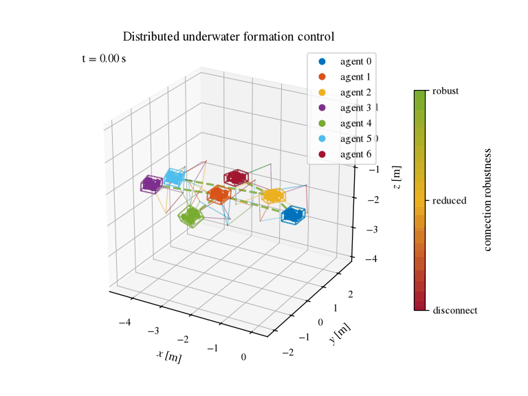

# Underwater Formation Control

Distributed formation control for multiple BlueROV2 Heavy underwater vehicles under sensing and actuation constraints.

The project combines:

- directed follower-to-parent sensing;
- distance and camera field-of-view constraints;
- recentered logarithmic barrier potentials;
- command-filtered backstepping;
- smooth norm saturation of the virtual twist;
- actuator-constrained CLF-QP control in thruster or body-wrench space;
- adaptive enlargement of conservative sensing domains toward the physical limits;
- long-horizon multi-robot validation with moving leaders;
- simulation-only robustness tests with uncertainty, current, noise, and delay.

<p align="center">
  
</p>

The animation above is generated from a dedicated seven-robot formation-acquisition demo: the leader remains stationary while the followers start from an asymmetric configuration and converge to the desired directed-tree formation. See [Generating the README animation](#generating-the-readme-animation).

## Overview

Each follower observes a unique parent through an onboard forward-looking camera. The sensing graph is therefore directed, with the convention

```text
observer -> parent
```

and is assumed to form a rooted tree.

For each follower, the controller combines a formation objective with distance and field-of-view constraints. The same second-order control architecture is used for the leader and the followers:

```text
configuration potential
        |
        v
generalized gradient
        |
        v
smooth norm-saturated virtual twist
        |
        v
command filter
        |
        v
backstepping CLF
        |
        v
actuator-constrained CLF-QP
        |
        v
BlueROV2 Heavy thruster forces or body wrench
```

The leader differs only in the upper-level objective. It can track either:

- a full position/velocity/acceleration trajectory; or
- a velocity command, converted to a smooth position/velocity/acceleration reference by a command filter.

## Control architecture

### BlueROV2 dynamics

Each vehicle is modeled with the standard six-degree-of-freedom marine dynamics

```text
eta_dot = J(eta) nu
M nu_dot = w + d - C(nu) nu - D(nu) nu - g(eta)
```

with the BlueROV2 Heavy thruster allocation

```text
w = B f
```

and physical thruster bounds enforced directly by the CLF-QP.

The default dynamics preset is `gazebo`, which reduces the active SITL SDF's
base and eight thruster links to one rigid body and reproduces its buoyancy,
added-mass, and damping values. The characterized real-robot presets
`standard` and `heavy_tube` remain selectable explicitly.

### Formation and sensing constraints

For every directed sensing edge, the follower regulates the desired relative position while maintaining:

- minimum inter-vehicle distance;
- maximum sensing range;
- positive camera depth;
- horizontal field of view;
- vertical field of view.

The conservative sensing domain is strictly contained in the physical sensing domain.

### Recentered barriers

The constraint potentials use recentered logarithmic barriers of the form

```text
B_bar(h; h_d) = -log(h / h_d) + h / h_d - 1
```

so that both the barrier value and its derivative with respect to the scalar constraint function vanish at the desired value.

### Smooth virtual-twist saturation

The virtual backstepping correction is smoothly saturated by norm, separately for translational and rotational components:

```text
ssat(x, x_bar)
    = x_bar tanh(||x|| / x_bar) x / ||x||
```

for nonzero `x`.

This preserves the direction of each correction block while preventing unrealistically large intermediate velocity commands.

Current BlueROV2 defaults are:

```text
translational virtual-speed limit: 1.5 m/s
rotational virtual-speed limit:    2.0 rad/s
```

### Adaptive sensing domain

When the conservative sensing domain becomes too restrictive under limited actuation, the controller can temporarily enlarge it toward the physical domain.

For each constraint,

```text
h_a = h_c + rho_bar s,
s in [0, 1].
```

The auxiliary state `s` is governed by a CBF-like condition that maintains a positive physical margin. When the enlargement is no longer needed, the nominal dynamics recover `s -> 0`.

## Installation

The project uses Python 3.12+ and [`uv`](https://docs.astral.sh/uv/).

From the repository root:

```bash
uv sync
```

Run the complete test/lint/format check with:

```bash
make check
```

Individual development commands can also be run through `uv`, for example:

```bash
uv run pytest
uv run ruff check .
uv run ruff format --check .
```

The ROS 2 integration targets ROS 2 Jazzy and lives in the same repository as
the core package. For its workspace layout, build instructions, and environment
setup, see [Installation and build](docs/experiments/installation_and_build.md).

## ROS 2 and PX4 integration

The `formation_control_ros` package is a thin runtime adapter around the
ROS-independent controller. It provides:

- leader and follower controller nodes;
- PX4 and motion-capture state adapters;
- explicit NED/FRD to NWU/FLU frame conversion;
- body-wrench normalization and PX4 offboard output;
- a centralized `INITIALIZE -> FORMATION` experiment phase manager;
- adaptive sensing-domain and pool-workspace constraints;
- controller diagnostics and versioned diagnostic snapshots.

The controller mathematics remains in `src/formation_control`; ROS messages,
frame conversion, lifecycle supervision, and PX4 communication remain in
`ros2/formation_control_ros`.

### SITL quick start

After building and sourcing the ROS workspace, start a two-robot PX4/Gazebo
simulation:

```bash
ros2 launch formation_control_ros multi_bluerov2_sim.launch.py \
  robot_count:=2 \
  px4_dir:=/path/to/PX4-Autopilot
```

In another terminal, start the Micro XRCE-DDS agent:

```bash
micro-xrce-dds-agent udp4 -p 8888
```

Then launch the experiment controllers. Launch files default to dry-run mode;
keep this enabled until state frames, controller diagnostics, and output signs
have been verified:

```bash
ros2 launch formation_control_ros two_robot_experiment.launch.py \
  dry_run:=true \
  leader_reference_mode:=velocity \
  workspace_barrier_enabled:=true \
  workspace_adaptive:=true
```

The complete procedures are documented in:

- [SITL setup](docs/experiments/simulation_setup.md)
- [Two-robot experiment](docs/experiments/two_robot_experiment.md)
- [Three-robot experiment](docs/experiments/three_robot_experiment.md)
- [Hardware setup and safety](docs/experiments/hardware_setup.md)
- [Controller parameters](docs/experiments/controller_parameters.md)
- [Troubleshooting](docs/experiments/troubleshooting.md)

### Experiment logging and plots

ROS experiments can be recorded to a rosbag, exported to a portable
`formation_history.npz`, and plotted with the same diagnostics used by the
pure-Python simulations:

```bash
scripts/record_formation_experiment.sh \
  --name two_robot_experiment \
  --robots itrl_rov_1,itrl_rov_2 \
  --edge itrl_rov_2:itrl_rov_1

python scripts/export_formation_bag.py outputs/experiments/<run>

uv run python scripts/plot_formation_experiment.py \
  outputs/experiments/<run>/formation_history.npz \
  --paper --paper-quality --save
```

See [ROS experiment logging and paper-plot pipeline](docs/experiment_logging.md)
for the snapshot schema, synchronization behavior, and available figures.

## Examples

### 04 — Adaptive formation stress test

This example exercises the camera-constrained controller under limited actuation:

```bash
uv run python examples/04_bluerov2_fov_clf_qp.py \
    --control-space thruster \
    --stress-test \
    --adaptive \
    --save
```

Useful diagnostics include:

- conservative and physical sensing margins;
- normalized domain enlargement;
- thruster utilization;
- required CLF slack;
- zero-slack actuation margin;
- sampled-data funnel safeguard activation.

### 05 — Seven robots with a leader velocity command

The leader receives an inertial velocity command. A reference command filter generates a smooth position, velocity, and acceleration reference for the same CLF-QP architecture used by the followers.

```bash
uv run python examples/05_bluerov2_constant_velocity_formation.py \
    --control-space thruster \
    --adaptive \
    --save
```

The default leader command is

```text
[0.35, 0.08, 0.0] m/s
```

and the default simulation duration is 150 s.

### 06 — Seven robots following a 3-D leader trajectory

The leader tracks a smooth full translational trajectory with supplied position, velocity, and acceleration:

```bash
uv run python examples/06_bluerov2_trajectory_formation.py \
    --control-space thruster \
    --adaptive \
    --save
```

The default simulation duration is 200 s.

The example reports performance separately by tree depth, which makes it possible to inspect propagation of tracking error through the directed cascade.

### README demo — Formation acquisition from displaced initial conditions

For the repository animation, the leader is kept stationary and the six followers start from a deliberately asymmetric configuration away from the desired formation:

```bash
uv run python examples/09_bluerov2_readme_formation_demo.py \
    --no-show
```

The example is intentionally short and uses tight spatial motion so that the BlueROV2 geometry and sensing links remain clearly visible throughout the animation. It is a visual demonstration of formation acquisition rather than a replacement for the longer validation cases.

### 07 — Realistic trajectory validation

This example adds simulation-only realism without modifying the controller:

```bash
uv run python examples/07_bluerov2_realistic_trajectory_validation.py \
    --control-space thruster \
    --adaptive \
    --save \
    --no-show
```

The default perturbations include:

- model-parameter uncertainty;
- unmodeled constant water current;
- relative-position measurement noise;
- body-twist measurement noise;
- fixed relative-measurement delay.

### 08 — Robustness Monte Carlo

A short Monte Carlo campaign can be run before moving to ROS/Gazebo:

```bash
uv run python examples/08_bluerov2_robustness_monte_carlo.py \
    --runs 10 \
    --duration 60
```

The summary focuses on:

- minimum physical sensing margin;
- maximum formation error;
- maximum adaptive enlargement;
- maximum thruster utilization;
- CLF feasibility;
- fallback occurrence.

## Seven-robot validation topology

The long-horizon examples use the balanced rooted tree

```text
            0
          /   \
         1     2
        / \   / \
       3   4 5   6
```

represented with the repository sensing convention as

```text
1 -> 0
2 -> 0
3 -> 1
4 -> 1
5 -> 2
6 -> 2
```

This gives a two-level cascade and makes it possible to compare formation performance at different graph depths.

## Generating the README animation

The README uses a dedicated GIF in which the leader remains stationary and the followers acquire the desired formation from visibly displaced initial conditions.

Run:

```bash
bash scripts/generate_readme_animation.sh
```

which executes the equivalent of

```bash
uv run python examples/09_bluerov2_readme_formation_demo.py \
    --duration 30 \
    --frame-stride 5 \
    --animation-format gif \
    --output docs/media/formation_animation.gif \
    --no-show
```

and writes

```text
docs/media/formation_animation.gif
```

The image link at the top of this README will then render automatically on GitHub.

For a quicker preview, reduce the duration, for example:

```bash
uv run python examples/09_bluerov2_readme_formation_demo.py \
    --duration 15 \
    --frame-stride 4 \
    --output docs/media/formation_animation.gif \
    --no-show
```

## Repository structure

```text
src/formation_control/
├── actuation/       # BlueROV2 Heavy thruster allocation and limits
├── constraints/     # distance and camera sensing constraints
├── control/         # command filters, CLF-QP, adaptive-domain logic
├── experiment/      # portable diagnostic snapshots and run histories
├── geometry/        # rigid-body and camera geometry
├── graphs/          # directed sensing graphs
├── models/          # marine vehicle models
├── potentials/      # formation, centering, and barrier potentials
├── simulation/      # simulation infrastructure and robustness models
└── visualization/   # plots and 3-D animations

ros2/formation_control_ros/
├── formation_control_ros/  # ROS nodes and runtime adapters
├── launch/                 # SITL and experiment launch files
└── config/                 # shared controller defaults

examples/                 # pure-Python demonstrations and validation cases
scripts/                  # experiment runners, recording, export, and plotting
tests/                    # core unit and integration tests
docs/experiments/         # reproducible SITL and hardware procedures
```

## Current development status

The control core, ROS 2 adapter, PX4/Gazebo SITL workflow, and experiment
logging pipeline are implemented. Three-robot SITL and the two-robot `cautious`
and `full` profiles have been validated. Real-water validation remains the next
major milestone.

Current milestones:

- [x] BlueROV2 6-DoF dynamics
- [x] directed tree formation model
- [x] camera field-of-view constraints
- [x] recentered logarithmic barriers
- [x] command-filtered backstepping
- [x] smooth norm saturation of the virtual twist
- [x] thruster-space CLF-QP
- [x] wrench-space CLF-QP over the achievable wrench polytope
- [x] adaptive conservative-to-physical sensing domains
- [x] adaptive pool-workspace constraints
- [x] long-horizon seven-robot moving-leader validation
- [x] common CLF-QP architecture for leader and followers
- [x] simulation-only uncertainty/noise/delay layer
- [x] ROS 2 leader/follower integration
- [x] PX4/Gazebo multi-robot SITL integration
- [x] two- and three-robot SITL experiment workflows
- [x] rosbag recording, portable export, and paper-plot pipeline
- [ ] BlueROV2 experimental validation

## Experiment architecture and safety

Experiment launches begin in a centralized `INITIALIZE` phase. The phase
manager changes to `FORMATION` only after every robot remains sufficiently
close to its initialization target and sufficiently slow for the configured
dwell time. Formation control is decentralized over the configured directed
sensing graph after that handoff.

The following must be verified against the physical setup before real-water
operation:

- initialization positions and physical workspace bounds;
- camera extrinsics and field-of-view parameters;
- state-estimation frame and velocity conventions;
- PX4 force/torque normalization and command limits;
- vehicle namespaces, IDs, health, and offboard behavior;
- the tested hold, disarm, and lost-sensing failsafe procedure.

The current controller fallback publishes zero wrench. This is useful for
simulation but is not a complete hardware failsafe. QGroundControl or another
tested manual intervention path must remain available during experiments. Use
the [poolside checklist](docs/experiments/experiment_checklist.md) for an actual
run.

## Development

Before committing changes, run:

```bash
make check
```

For the longer simulations, it is usually convenient to save outputs without opening figures:

```bash
--save --no-show
```

Animations can be generated separately once the numerical run has been validated.
